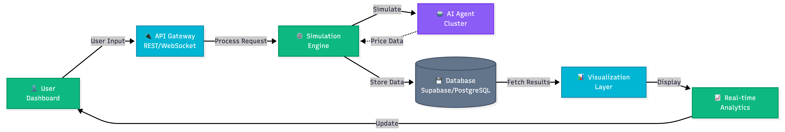

# Project Title: Dynamic Pricing Simulator
One line project description: An autonomous economic simulation engine that can stress-test dynamic pricing models against AI-driven competitor agents to maximize revenue and inventory health.

## 1. Problem Statement
### Problem Title: Dynamic Pricing Simulator
Businesses lack an interactive simulation system that models pricing decisions under realistic constraints.
### Problem Description: 
In competitive e-commerce markets, pricing decisions directly impact revenue, market share, and inventory turnover. Businesses must constantly balance demand elasticity, competitor behavior, and stock availability while adjusting pricing strategies. However, most pricing decisions are made using static spreadsheets or limited historical data analysis. There is limited opportunity to simulate dynamic market environments before implementing pricing strategies in real-world systems.

### Target Users: 
* E-commerce Category Managers
* Revenue Growth and Optimization Teams
* Inventory and Supply Chain Analysts

### Existing Gaps
* Businesses lack an interactive simulation system that models pricing under realistic constraints.
* Difficulty in modeling demand curves and competitor reactions accurately.
* Inability to evaluate the long-term impact of short-term pricing "race-to-the-bottom" tactics.
* Without predictive simulation:
    Pricing strategies may reduce profit margins,
    Overstock or stockouts may occur,
    Market share may decline unexpectedly,
    Businesses react rather than strategize,
    Revenue optimization opportunities are missed,
    Lack of experimentation tools limits strategic decision-making.

## 2. Problem Understanding & Approach

### Root Cause Analysis
The primary issue is the high financial risk associated with real-world pricing experimentation. Without a predictive simulation framework, businesses react to market shifts rather than strategizing for them, leading to missed revenue optimization and unexpected stockouts.

### Solution Strategy
Our approach is to build a **Dynamic Pricing Simulator** that enables strategic experimentation in a controlled environment. We utilize a mathematical demand-elasticity engine and autonomous competitor bots to visualize the friction between pricing, market share, and stock levels over time.

## 3. Proposed Solution

### Solution Overview
Our simulator provides a high-fidelity "War Room" dashboard where users can configure product parameters and run pricing strategies across simulated time periods.

### Core Idea
To democratize advanced economic modeling by providing an interactive platform where users "play" against different market personalities to find the optimal price-to-inventory balance. The objective is to create simulation engine that enables strategic pricing experimentation in a controlled environment.

### Key Features
* **Configurable Parameters:** Users can adjust base demand, price sensitivity, and inventory constraints.
* **Intelligent Competitor Bots:** Models reactions from "Aggressive Under-cutters" to "Premium Players".
* **Dynamic Visualizations:** Animated time-series charts for scenario comparison of revenue, market share, and stock levels.

## 4. System Architecture

### High-Level Flow
**User** → **Next.js Frontend** → **FastAPI Backend** → **Simulation Engine** → **Supabase Database** → **Visual Response**

### Architecture Description
The system follows a decoupled architecture. The **Frontend** (Next.js) handles state management and real-time chart rendering via Recharts. The **Backend** (FastAPI) executes the core simulation loops, demand math, and competitor agent logic.

### Architecture Diagram:

## 5. Database Design

### ER Diagram

### ER Diagram Description
The database tracks `Simulations`, which house multiple `TimeSteps`. Each `TimeStep` records `UserPrice`, `CompetitorPrice`, `UnitsSold`, and `RemainingInventory` to allow for historical session comparisons.

## 6. Dataset Selected

### Dataset Name
Synthetic E-commerce Elasticity Model.

### Source
Derived from standard economic demand-supply equilibrium formulas (Linear Demand Model).

### Data Type
Time-series numerical data.

### Selection Reason
Synthetic data allows for pure "What-If" scenario testing and stress-testing edge cases (like stockouts) without the bias of specific historical datasets.

## 7. Model Selected

### Model Name
Linear Demand Elasticity with Stochastic Noise.

### Selection Reasoning
Provides a transparent and adjustable simulation framework that remains mathematically sound while allowing for real-time interactivity.

### Alternatives Considered
* **Constant Elasticity Model:** Rejected due to higher computational overhead for 24-hour real-time feedback.

### Evaluation Metrics
* **Revenue Maximization Ratio**
* **Inventory Turnover Rate**
* **Market Share Stability**

## 8. Technology Stack

### Frontend
Next.js, Tailwind CSS, Recharts, shadcn/ui.

### Backend
Python (FastAPI), Uvicorn.

### ML/AI
Logic-based Competitor Agents (Behavioral Trees/Game Theory).

### Database
Supabase (PostgreSQL).

### Deployment
Vercel (Frontend) / Railway (Backend).

## 9. API Documentation & Testing

### API Endpoints List

* **Endpoint 1:** `POST /api/v1/simulation/start` - Initializes session with product/inventory parameters.
* **Endpoint 2:** `POST /api/v1/simulation/step` - Processes a single day's pricing decision and returns bot reactions.
* **Endpoint 3:** `GET /api/v1/simulation/history/{id}` - Fetches all time-steps for chart rendering.

### API Testing Screenshots
*(Add Postman / Thunder Client screenshots here)*

## 10. Module-wise Development & Deliverables

### Checkpoint 1: Research & Planning
[cite_start]**Deliverables:** Finalized UVP, Problem Definition, and Repository Setup[cite: 14].

### Checkpoint 2: Backend Development
[cite_start]**Deliverables:** FastAPI structure, Demand Logic, and Competitor Bot AI[cite: 16].

### Checkpoint 3: Frontend Development
[cite_start]**Deliverables:** Dashboard Layout, Input Sliders, and Chart Components[cite: 23].

### Checkpoint 4: Model Training
**Deliverables:** Fine-tuning bot reaction parameters and elasticity coefficients.

### Checkpoint 5: Model Integration
**Deliverables:** E2E data flow between pricing sliders and animated charts.

### Checkpoint 6: Deployment
[cite_start]**Deliverables:** Live URL and Demo Data preparation[cite: 25, 26].

## 11. End-to-End Workflow
User inputs Product Data → Sets Daily Price → Backend calculates Demand & Bot Reaction → Inventory updates → Frontend animates results on a 30-day timeline.

## 12. Demo & Video
* **Live Demo Link:** [Insert Link]
* **GitHub Repository:** [Insert Link]

## 13. Hackathon Deliverables Summary
* Interactive Pricing "War Room" Dashboard.
* Automated Competitor AI Reaction Engine.
* Real-time Revenue & Stock Analytics.

## 14. Team Roles & Responsibilities

| Member Name | Role | Responsibilities |
| :--- | :--- | :--- |
| **Arju Srivastav** | **Product Lead & Integration** | UVP, UI Design, Git Management, System Integration. |
| **Dhruv Baheti** | **Backend Architect** | FastAPI Development, Simulation Math, Competitor Logic. |
| **Aridaman Singh** | **Frontend Developer** | Dashboard Layout, Recharts Integration, Responsive Design. |

## 15. Future Scope & Scalability

### Short-Term
* Integration with Shopify/Amazon APIs for live inventory syncing.
* Multi-product simulation (simulating cross-product cannibalization).

### Long-Term
* Reinforcement Learning (RL) agents for self-optimizing pricing.

## 16. Known Limitations
* Currently assumes a closed market environment with one primary competitor per simulation.

## 17. Impact
Enables e-commerce businesses to protect profit margins and prevent destructive price wars, potentially saving thousands in lost revenue and inventory mismanagement.
